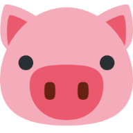

<div align="center">


[](https://twitter.com/Pranav_Jadhav09)
[](https://thejrpranav09.hashnode.dev/how-to-make-rock-paper-scissor-game-using-javascript)

<br />
<br />



<h2 align="center">Pig Dice | Game</h2>
Built a Pig Dice game using JavaScript.
Play the classic Pig Dice Game online! Roll the dice, accumulate points, and avoid the Pig Out. Challenge friends or the computer in this addictive web game built with HTML, CSS, and JavaScript. Enjoy smooth animations, strategic gameplay, and aim for the highest score. Experience the excitement now!

<a href="https://rockpaperscissor-jrpranav.netlify.app/"><strong>➥ Play Now</strong></a>

</div>

<br />

### What I Learn

- Using Functions
- Using Ternary Operator
- Using Event Handlers

### Prerequisites

Before you begin, ensure you have met the following requirements:

- [Git](https://git-scm.com/downloads "Download Git") must be installed on your operating system.

### Run Locally

To run **Pig Dice Game**, run this command on your git bash:

Linux and macOS:

```bash
sudo git clone https://github.com/Pranav-Jadhav09/pig-dice-gamee.git
```

Windows:

```bash
git clone https://github.com/Pranav-Jadhav09/pig-dice-game.git
```

### License

MIT
